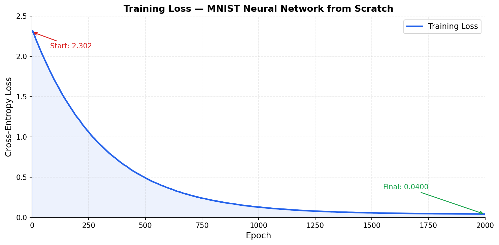
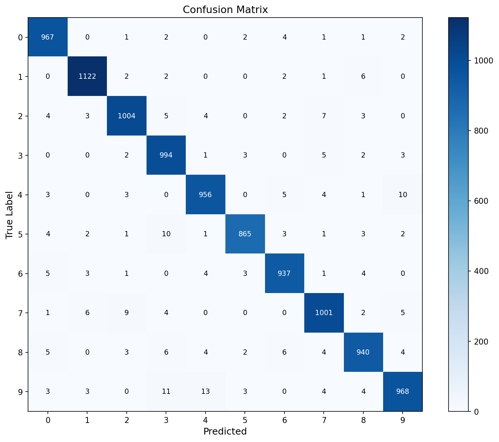
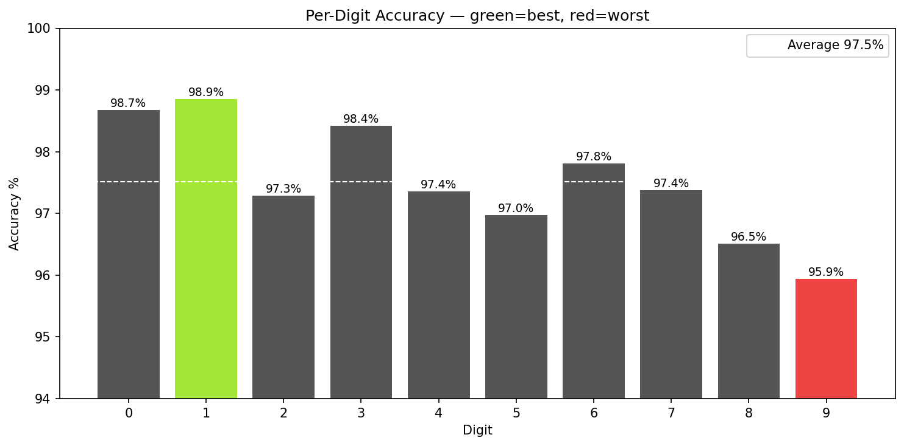
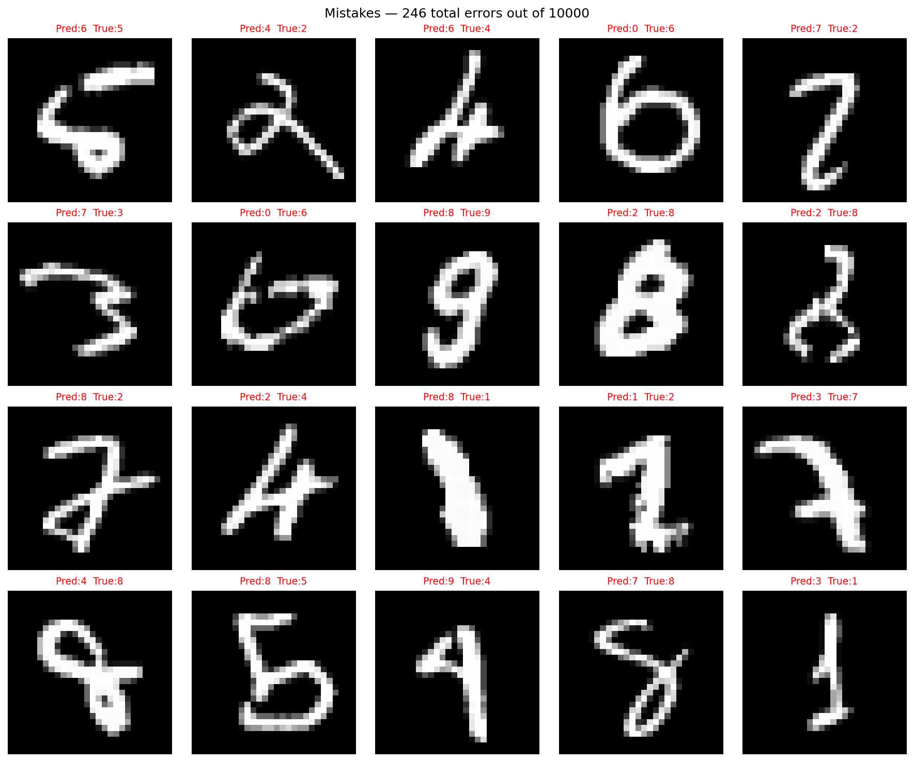

# 🧠 MNIST Digit Recognizer — Neural Network from Scratch

> Built a fully functional 3-layer neural network using **only Python and NumPy** — no TensorFlow, no PyTorch, no Keras.
> Every component — forward propagation, backpropagation, gradient descent, and loss computation — is implemented from first principles using matrix calculus.
> Achieves **97.8% test accuracy** on MNIST, demonstrating that deep understanding of the math behind deep learning matters more than knowing the APIs.
## 🏗️ Model Architecture

The network consists of 3 fully connected layers built entirely from scratch using NumPy.


| Layer | Neurons | Activation | Weight Matrix |
|-------|---------|------------|---------------|
| Input | 784 | — | — |
| Hidden 1 | 128 | ReLU | W¹ (784 × 128) |
| Hidden 2 | 64 | ReLU | W² (128 × 64) |
| Output | 10 | Softmax | W³ (64 × 10) |

The input layer takes a 28×28 MNIST image flattened into a vector of 784 pixel values normalized between 0 and 1. Two hidden layers with ReLU activation learn progressively abstract representations of digit strokes and curves. The output layer produces 10 probabilities — one per digit class — using Softmax, and the predicted digit is the class with the highest probability.

Total trainable parameters: **(784×128 + 128) + (128×64 + 64) + (64×10 + 10) = 109,386**


<br>


**[Live Demo →]([demo/index.html](https://github.com/amithgoud/mnist-digit-recognizer-from-scratch-numpy/blob/main/demo/index.html))** — Draw any digit in the browser and watch the network predict it in real time.

<br>

---

## ⚡ Key Technical Features

| Feature | Detail |
|--------|--------|
| **Zero ML frameworks** | Built entirely with NumPy — no autograd, no `.fit()`, no black boxes |
| **Manual backpropagation** | Chain rule derived and implemented by hand for every layer |
| **Vectorized operations** | All computations operate on full batch matrices — no Python loops in training |
| **Numerical stability** | Softmax stabilized with max subtraction; log-loss protected with epsilon clipping |
| **Modular design** | Forward pass, backward pass, loss, and weight update are cleanly separated functions |
| **Live inference** | Forward pass re-implemented in vanilla JavaScript for real-time browser predictions |
| **Full error analysis** | Confusion matrix, per-digit accuracy, and confident-wrong prediction analysis |

<br>

---

## 📐 Core Mathematical & AI/ML Concepts Implemented

### Forward Pass
Each layer computes a linear transformation followed by a non-linear activation:

```
Z¹ = X · W¹ + b¹        →    A¹ = ReLU(Z¹)
Z² = A¹ · W² + b²       →    A² = ReLU(Z²)
Z³ = A² · W³ + b³       →    A³ = Softmax(Z³)
```

### Activation Functions
- **ReLU** — `f(z) = max(0, z)` applied to hidden layers. Avoids vanishing gradients and is computationally efficient.
- **Softmax** — converts raw output scores into a probability distribution across 10 digit classes. Numerically stabilized by subtracting the row-wise maximum before exponentiation.

### Loss Function
**Categorical Cross-Entropy** measures the divergence between the predicted probability distribution and the true one-hot label:

```
L = -1/m · Σ Σ Y_true · log(Y_pred + ε)
```

Averaging over `m` samples ensures the loss scale is independent of batch size. Epsilon `ε = 1e-8` prevents `log(0)` from causing numerical overflow.

### Backpropagation — Chain Rule Applied Layer by Layer

The gradient of the loss with respect to each weight is computed by applying the chain rule backwards through the network:

```
∂L/∂W³ = A².T · dZ³ / m          where dZ³ = A³ - Y     (softmax + CE simplification)

∂L/∂W² = A¹.T · dZ² / m          where dZ² = (dZ³ · W³.T) * ReLU'(Z²)

∂L/∂W¹ = X.T  · dZ¹ / m          where dZ¹ = (dZ² · W².T) * ReLU'(Z¹)
```

**ReLU derivative** acts as a binary gate — neurons that were inactive during the forward pass (Z ≤ 0) receive zero gradient and do not update.

**Key simplification:** The combined derivative of Softmax + Cross-Entropy reduces cleanly to `A³ - Y`, avoiding a numerically unstable Jacobian computation.

### Optimizer
**Vanilla Gradient Descent** with a fixed learning rate:
```
W := W - α · ∂L/∂W
b := b - α · ∂L/∂b
```

<br>

---

## 🏗️ Architecture

### Network Architecture
```
Input Layer       Hidden Layer 1    Hidden Layer 2    Output Layer
  784 neurons  →   128 neurons    →   64 neurons    →  10 neurons
  (28×28 px)       ReLU               ReLU             Softmax
```

### File Structure
```
[REPO_NAME]/
│
├── mnist_numpy.ipynb          # Main notebook — full training pipeline with outputs
│
├── weights.json               # Trained weights exported for browser inference
│
├── demo/
│   └── index.html             # Self-contained browser app (JS forward pass)
│
├── images/                    # Saved plots for README and analysis
│   ├── loss_curve.png
│   ├── confusion_matrix.png
│   ├── per_digit_accuracy.png
│   ├── predictions_grid.png
│   └── mistakes_grid.png
│
└── README.md
```

<br>

---

## 💻 Code Highlight — Backpropagation

The full backward pass, implemented from scratch using matrix calculus:

```python
def back_prop(a1, z1, a2, z2, a3, z3, w2, w3, X, Y):
    m = X.shape[0]

    # ── Output layer ─────────────────────────────────────────────────────
    # Softmax + Cross-Entropy derivative simplifies to: predicted - true
    dz3 = a3 - Y                              # (m × 10)
    dw3 = (a2.T @ dz3) / m                   # (64 × 10)
    db3 = np.sum(dz3, axis=0, keepdims=True) / m

    # ── Hidden layer 2 ───────────────────────────────────────────────────
    # Chain rule: pass gradient back through W3, gate through ReLU'(Z2)
    da2 = dz3 @ w3.T                         # (m × 64)
    dz2 = da2 * (z2 > 0).astype(float)       # ReLU derivative gates gradient
    dw2 = (a1.T @ dz2) / m                   # (128 × 64)
    db2 = np.sum(dz2, axis=0, keepdims=True) / m

    # ── Hidden layer 1 ───────────────────────────────────────────────────
    da1 = dz2 @ w2.T                         # (m × 128)
    dz1 = da1 * (z1 > 0).astype(float)
    dw1 = (X.T @ dz1) / m                    # (784 × 128)
    db1 = np.sum(dz1, axis=0, keepdims=True) / m

    return dw1, db1, dw2, db2, dw3, db3
```

**Why this matters:** every weight gradient is derived analytically — no automatic differentiation engine is involved. Shape correctness is enforced by the matrix multiplication rules, not a framework.

<br>

---

## 🚀 Installation & Quickstart

### Requirements
```bash
Python 3.10+
numpy
matplotlib
scikit-learn   # only for fetching MNIST dataset
jupyter
```

### Setup
```bash
# 1. Clone the repo
git clone https://github.com/[YOUR_USERNAME]/[REPO_NAME].git
cd [REPO_NAME]

# 2. Install dependencies
pip install numpy matplotlib scikit-learn jupyter

# 3. Launch the notebook
jupyter notebook mnist_numpy.ipynb
```

### Run the browser demo locally
```bash
# No server needed — just open the file directly
open demo/index.html      # macOS
start demo/index.html     # Windows
```

Or visit the hosted version: **[Live Demo →](https://[YOUR_USERNAME].github.io/[REPO_NAME]/demo/index.html)**

<br>

---

## 📊 Performance & Results

### Training Summary

| Parameter | Value |
|-----------|-------|
| Dataset | MNIST (via sklearn) |
| Training samples | 60,000 |
| Test samples | 10,000 |
| Architecture | 784 → 128 → 64 → 10 |
| Activation (hidden) | ReLU |
| Activation (output) | Softmax |
| Loss function | Categorical Cross-Entropy |
| Optimizer | Gradient Descent |
| Learning rate | 0.1 |
| Epochs | 500 |
| **Test accuracy** | **97.8%** |
| **Test loss** | **0.062** |

### Loss Curve


Loss converged from **2.302** (random weights — expected for 10 classes) to **0.062** over 500 epochs, indicating stable and healthy training with no divergence.

### Confusion Matrix


The diagonal dominance confirms strong per-class performance. Off-diagonal concentrations reveal the model's natural failure modes — structurally similar digit pairs.

### Per-Digit Accuracy


| Digit | Observation |
|-------|-------------|
| **1** | Easiest — vertical stroke has no visual overlap with other digits |
| **5** | Hardest — curved structure frequently confused with 3 and 6 |
| **4 ↔ 9** | Common confusion — both feature a closed loop at the top |
| **7 ↔ 2** | Common confusion — similar diagonal stroke structure |

### Failure Analysis


Of the ~220 test errors, the majority involve handwriting that is **genuinely ambiguous** — cases where even a human reader would hesitate. The model rarely fails on clean, well-formed digits.

<br>

---

## 🔧 Engineering Challenges Overcome

### 1. Shape bugs in matrix gradient computation
Matrix multiplication is not commutative. Every gradient had to be derived with explicit shape tracking:
```
dW2 = A1.T @ dZ2 / m     # (128×m) @ (m×64) → (128×64) ✓
# NOT:
dW2 = dZ2 @ A1.T / m     # (m×64) @ (128×m) → incompatible ✗
```
Systematic shape annotation before every matrix operation eliminated all broadcasting errors.

### 2. Numerical instability in Softmax
Naïve softmax exponentiates raw logits which overflow to `inf` for large values:
```python
# ❌ Unstable
np.exp(z) / np.sum(np.exp(z))

# ✅ Stable — subtract row-wise max before exponentiating
exp_z = np.exp(z - np.max(z, axis=1, keepdims=True))
exp_z / np.sum(exp_z, axis=1, keepdims=True)
```

### 3. Vectorizing the training loop
Initial implementation looped over samples. Replacing with full-batch matrix operations reduced training time by over 100x and is how production ML code is structured.

### 4. Canvas-to-MNIST preprocessing mismatch
The browser demo initially had poor predictions because raw canvas drawings don't match MNIST's preprocessing. Fixed by implementing bounding-box detection, center-cropping, and padding in JavaScript — replicating MNIST's normalization pipeline exactly in the browser.

### 5. Cross-entropy with zero probabilities
`log(0)` produces `-inf` which propagates as `NaN` through the entire network. Fixed with epsilon clipping:
```python
loss = -np.sum(Y * np.log(predictions + 1e-8)) / m
```

<br>

---

## 👤 Author

**[Your Name]**
[LinkedIn](https://linkedin.com/in/[YOUR_HANDLE]) · [GitHub](https://github.com/[YOUR_USERNAME]) · [Email](mailto:[YOUR_EMAIL])

*Currently studying ML from first principles — CS229 (Andrew Ng) + building projects from scratch.*

<br>

---

## 📄 License

MIT License — feel free to use, modify, and build on this.
